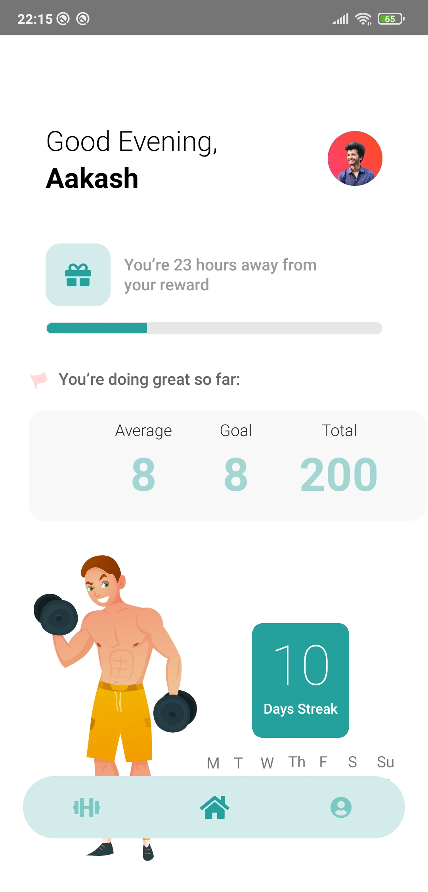

# [GymApp](https://github.com/rahulrajdahal/gym-app-reactNative). A workout application for individuals and busy people

## 🏗 Installation

### 1. clone the repository

```sh
git clone https://github.com/rahulrajdahal/gym-app-reactNative
```

### 2. Install Dependencies

#### yarn

```sh
cd GymApp && yarn install
```

### 3. Run the server

```sh
yarn start
```

### 4. Run on android

```sh
yarn android
```

#### OR

### Run on ios

```sh
yarn ios
```

## Preview

[](https://github.com/rahulrajdahal/gym-app-reactNative)

## 🚀 Project Structure

Inside of project [GymApp](https://github.com/rahulrajdahal/gym-app-reactNative), you'll see the following folders and files:

```text
/
├── ios/
├── android/
├── assets/
│   ├── icons/
│   │   └── icon.svg
│   ├── illustrations/
│   │   └── illustration.svg
│   ├── themes/
│   │   └── colors.ts
│   │   └── sizes.ts
├── screenshots/
|   └── screenshot.png
├── src/
|   ├── components/
│   │   └── Component.tsx
|   ├── navigations/
│   │   └── Navigation.tsx
|   └── screens/
│       └── Screen.tsx
└── App.tsx
└── index.js
└── README.md
└── package.json
```

## 🧞 Commands

All commands are run from the root of the project, from a terminal:

| Command        | Action                                                 |
| :------------- | :----------------------------------------------------- |
| `yarn install` | Installs dependencies.                                 |
| `yarn lint`    | Check all linting errors.                              |
| `yarn start`   | Starts the server at `localhost:8081`.                 |
| `yarn android` | Starts the server and opens the app on android device. |
| `yarn ios`     | Starts the server and opens the app on ios device.     |
